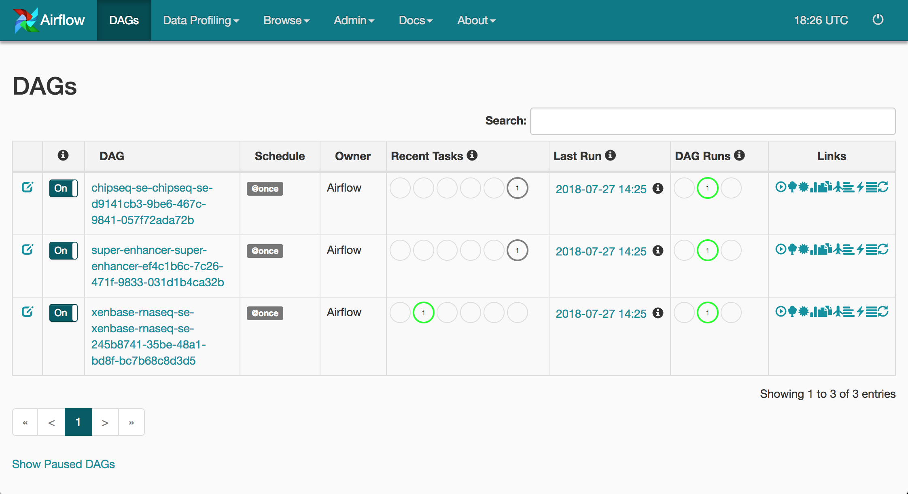
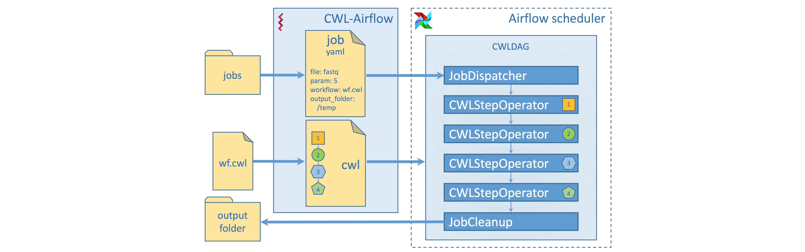

[](https://travis-ci.org/Barski-lab/cwl-airflow) -  **Travis CI**  
[](https://ci.commonwl.org/job/airflow-conformance) - **CWL conformance tests**  

# cwl-airflow

Python package to extend **[Apache-Airflow 1.9.0](https://github.com/apache/incubator-airflow)**
functionality with **[CWL v1.0](http://www.commonwl.org/v1.0/)** support.

## Check it out
*(assuming that you already have installed and properly configured **python**, latest **pip**, latest **setuptools**
and **docker** that has access to pull images from the [DockerHub](https://hub.docker.com/);
if something is missing or should be updated refer to [Installation](#installation) or [Troubleshooting](Troubleshooting) sections)*
1. Install *cwl-airflow*
    ```sh
    $ pip install cwl-airflow --find-links https://michael-kotliar.github.io/cwl-airflow-wheels/
    ```
2. Init configuration
    ```sh
    $ cwl-airflow init
    ```
3. Run *demo*
    ```sh
    $ cwl-airflow demo --auto
    ```
4. When all demo wokrflows are submitted program will provide you with the link for Airflow Webserver.
It may take some time (usually less then half a minute) for Airflow Webserver to load and display all the data





---

## Table of Contents

* **[How It Works](#how-it-works)**
  * [Key concepts](#key-concepts)
* **[Installation](#installation)**
  * [Requirements](#requirements)
    * [Ubuntu 16.04.4 (Xenial Xerus)](#ubuntu-16044-xenial-xerus)
    * [macOS 10.13.5 (High Sierra)](#macos-10135-high-sierra)
    * [Both Ubuntu and macOS](#both-ubuntu-and-macos)
  * [Install cwl-airflow](#install-cwl-airflow)
* **[Using cwl-airflow](#using-cwl-airflow)**
    * [Configuration](#configuration)
    * [Submitting new job](#submitting-new-job)
    * [Demo mode](#demo-mode)
* **[Troubleshooting](#Troubleshooting)**

---

## How It Works
### Key concepts

1. **CWL descriptor file** - *YAML* or *JSON* file to describe the workflow inputs, outputs and steps.
   File should be compatible with CWL v1.0 specification
2. **Job file** - *YAML* or *JSON* file to set the values for the wokrflow inputs.
   For *cwl-airflow* to function properly the Job file should include 3 mandatory and 
   one optional fields:
   - *workflow* - mandatory field to specify the absolute path to the CWL descriptor file
   - *output_folder* - mandatory field to specify the absolute path to the folder
   where all the output files should be moved after successful workflow execution
   - *tmp_folder* - optional field to specify the absolute path to the folder
   for storing intermediate results. After workflow execution this folder will be deleted.
   - *uid* - mandatory field that is used for generating DAG's unique identifier. 
3. **DAG** - directed acyclic graph that describes the workflow structure.
4. **Jobs folder** - folder to keep all Job files scheduled for execution or the ones that
have already been processed. The folder's location is set as *jobs* parameter of *cwl* section
in Airflow configuration file.  

To build a workflow *cwl-airflow* uses three basic classes:
- *CWLStepOperator* - executes a separate workflow step 
- *JobDispatcher* - serializes the Job file and provides the worflow with input data
- *JobCleanup* - returns the calculated results to the output folder

A set of *CWLStepOperator*s, *JobDispatcher* and *JobCleanup* are
combined in *CWLDAG* that defines a graph to reflect the workflow steps, their relationships
and dependencies. Automatically generated *cwl_dag.py* script is placed in the DAGs folder. When Airflow
Scheduler loads DAGs from the DAGs folder, the *cwl_dag.py* script parses all the Job files from the Jobs folder
and creates DAGs for each of them. 



---

## Installation
### Requirements 
#### Ubuntu 16.04.4 (Xenial Xerus)
- python 2.7 or 3.5 (tested on the system Python 2.7.12 and 3.5.2)
- docker
  ```
  sudo apt-get update
  sudo apt-get install apt-transport-https ca-certificates curl software-properties-common
  curl -fsSL https://download.docker.com/linux/ubuntu/gpg | sudo apt-key add -
  sudo add-apt-repository "deb [arch=amd64] https://download.docker.com/linux/ubuntu $(lsb_release -cs) stable"
  sudo apt-get update
  sudo apt-get install docker-ce
  sudo groupadd docker
  sudo usermod -aG docker $USER
  ```
  Log out and log back in so that your group membership is re-evaluated.
- python-dev (or python3-dev if using Python 3.5)
  ```bash
  sudo apt-get install python-dev # python3-dev
  ``` 
  *python-dev* is required in case your system needs to compile some python
  packages during the installation. We have built python *wheels* for most of such packages
  and provided them through *--find-links* argument while installing *cwl-airflow*.
  Nevertheless in case of installation problems you might still be required to install
  this dependency.
  
#### macOS 10.13.5 (High Sierra)
- python 2.7 or 3.6 (tested on the system Python 2.7.10 and brewed Python 2.7.15 and 3.6.5, **3.7.0 is not supported**)
- docker (follow the [link](https://docs.docker.com/docker-for-mac/install/)
  to install Docker on Mac)
- Apple Command Line Tools
  ```bash
  xcode-select --install
  ```
  Click *Install* on the pop up when it appears, follow the instructions. *Apple Command Line Tools* are required in
  case your system needs to compile some python packages during the installation. We have built python wheels for most
  of such packages and provided them through *--find-links* argument while installing *cwl-airflow*. Nevertheless in case
  of installation problems you might still be required to install this dependency.
  
#### Both Ubuntu and macOS
- pip (tested on pip 18.0)
  ```bash
  wget https://bootstrap.pypa.io/get-pip.py
  python get-pip.py # --user
  ```
- setuptools (tested on setuptools 40.0.0)
  ```bash
  pip install -U setuptools # --user
  ```
  
  `--user` - optional parameter to install all the packages into your *HOME* directory instead of the system Python
  directories. You might need to update your *PATH* variable in order to have access to the installed packages (an easy
  way to do it is described in [Troubleshooting](#Troubleshooting) section).
  If installing on macOS brewed Python `--user` **should not** be used (explained [here](https://docs.brew.sh/Homebrew-and-Python))

### Install cwl-airflow
```sh
$ pip install cwl-airflow --find-links https://michael-kotliar.github.io/cwl-airflow-wheels/ # --user
```
`--find-links` - using pre-compiled wheels from [This](https://michael-kotliar.github.io/cwl-airflow-wheels/) repository
allows to avoid installing *Xcode* for macOS users and *python[3]-dev* for Ubuntu users

`--user` - optional parameter to install all the packages into your *HOME* directory instead of the system Python
directories. You might need to update your *PATH* variable in order to have access to the installed packages (an easy
way to do it is described in [Troubleshooting](#Troubleshooting) section). If
installing on macOS brewed Python `--user` **should not** be used (explained [here](https://docs.brew.sh/Homebrew-and-Python))

---

## Using cwl-airflow

### Configuration

Before using *cwl-airflow* it should be initialized with the default configuration by running the command
```sh
$ cwl-airflow init
```

Optional parameters:

| Flag | Description                                                           | Default                                       |
|------|-----------------------------------------------------------------------|-----------------------------------------------|
| -l   | number of processed jobs kept in history, int                         | 10 x *Running*, 10 x *Success*, 10 x *Failed* |
| -j   | path to the folder where all the new jobs will be added, str          | *~/airflow/jobs*                              |
| -t   | timeout for importing all the DAGs from the DAG folder, sec           | 30                                            |
| -r   | webserver workers refresh interval, sec                               | 30                                            |
| -w   | number of webserver workers to be refreshed at the same time, int     | 1                                             |
| -p   | number of threads for Airflow Scheduler, int                          | 2                                             |

If you update Airflow configuration file manually (default location is *~/airflow/airflow.cfg*),
make sure to run *cwl-airflow init* command to apply all the changes,
especially if *core/dags_folder* or *cwl/jobs* parameters from the configuration file are changed.
  
### Submitting new job

To submit new CWL descriptor and Job files to *cwl-airflow* run the following command
```bash
cwl-airflow submit WORKFLOW JOB
```

Optional parameters:

| Flag | Description                                                                                            | Default           |
|------|--------------------------------------------------------------------------------------------------------|-------------------|
| -o   | path to the folder where all the output files should be moved after successful workflow execution, str | current directory |
| -t   | path to the temporary folder for storing intermediate results, str                                     | */tmp*            |
| -u   | ID for DAG's unique identifier generation, str                                                         | random uuid       |
| -r   | uns submitted workflow with Airflow Scheduler, bool                                                    | False             |

Arguments `-o`, `-t` and `-u` doesn't overwrite the values from the Job file set in the fields
*output_folder*, *tmp_folder* and *uid* correspondingly.

The *submit* command will resolve all relative paths from Job file adding mandatory fields *workflow*, *output_folder*
and *uid* (if not provided) and will copy Job file to the Jobs folder. The CWL descriptor file and all input files
referenced in the Job file should not be moved or deleted while workflow is running. The *submit* command will **not** execute
submitted workflow unless *-r* argument is provided. Otherwise, make sure that *Airflow Scheduler* (and optionally
*Airflow Webserver*) is running.

To start Airflow Scheduler
```bash
airflow scheduler
```
To start Airflow Webserver
```bash
airflow webserver
```

### Demo mode
To get the list of the available demo workflows to run
```bash
$ cwl-airflow demo --list
```
To submit demo workflow from the list
(to execute submitted wokrflow Airflow Scheduler should be started separately)
```bash
$ cwl-airflow demo super-enhancer.cwl
```
To submit all available demo workflows
(to execute submitted wokrflows Airflow Scheduler should be started separately)
```bash
$ cwl-airflow demo --manual
```
To execute all available demo workflows (automatically starts Airflow Scheduler and Airflow Webserver)
```bash
$ cwl-airflow demo --auto
```

Optional parameters:

| Flag | Description                                                                                            | Default           |
|------|--------------------------------------------------------------------------------------------------------|-------------------|
| -o   | path to the folder where all the output files should be moved after successful workflow execution, str | current directory |
| -t   | path to the temporary folder for storing intermediate results, str                                     | */tmp*            |
| -u   | ID for DAG's unique identifier generation, str                                                         | random uuid       |


### Troubleshooting

Most of the problems are already handled by *cwl-airflow* itself. User is provided
with the full explanation and ways to correct them through the console output. Additional
information regarding the failed workdlow steps, can be found in the task execution logs
that are accessible through Airflow Webserver UI. 

Common errors due to different Python version and different ways to install it
- `cwl-airflow` is not found 
   
   Perhaps, you have installed it with *--user* option and your *PATH*
   variable doesn't include your user based Python *bin* folder.
   Update *PATH* with the following command
   ```sh
   export PATH="$PATH:`python -m site --user-base`/bin"
   ```
- Fails to install on the latest *Python 3.7.0*
  
  Unfortunatelly *Apache-Airflow 1.9.0* cannot be properly installed on the latest *Python 3.7.0*.
  Consider using *Python 3.6* or *2.7* instead.
  
- Docker is unable to pull images from the Internet.

  If you are using proxy, your Docker should be configured properly too.
  Refer to the official [documentation](https://docs.docker.com/config/daemon/systemd/#httphttps-proxy)
   
- Docker is unable to mount directory.

  For macOS docker has a list of directories that it's allowed to mount by default. If your input files are located in
  the directories that are not included in this list, you are better of either changing the location of
  input files and updating your Job file or adding this directories into Docker configuration *Preferences / File Sharing*.