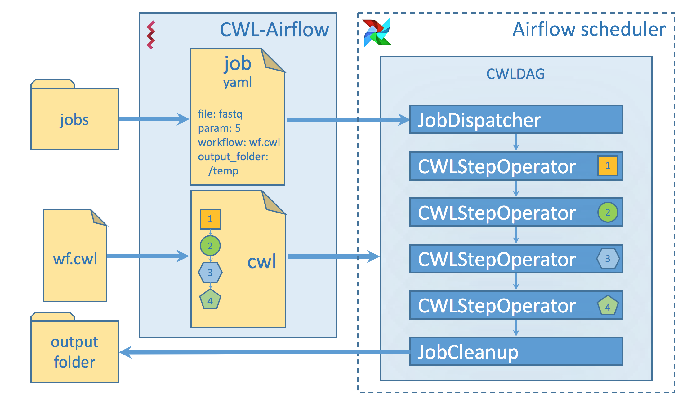

# How it works

## Key concepts

1. **CWL descriptor file** - *YAML* or *JSON* file to describe the workflow inputs, outputs and steps.
   File should be compatible with CWL v1.0 specification
2. **Job file** - *YAML* or *JSON* file to set the values for the wokrflow inputs.
   For *cwl-airflow* to function properly the Job file should include 3 mandatory and 
   one optional fields:
   - *workflow* - mandatory field to specify the absolute path to the CWL descriptor file
   - *output_folder* - mandatory field to specify the absolute path to the folder
   where all the output files should be moved after successful workflow execution
   - *tmp_folder* - optional field to specify the absolute path to the folder
   for storing intermediate results. After workflow execution this folder will be deleted.
   - *uid* - mandatory field that is used for generating DAG's unique identifier. 
3. **DAG** - directed acyclic graph that describes the workflow structure.
4. **Jobs folder** - folder to keep all Job files scheduled for execution or the ones that
have already been processed. The folder's location is set as *jobs* parameter of *cwl* section
in Airflow configuration file.  

## What's inside

To build a workflow *cwl-airflow* uses three basic classes:
- *CWLStepOperator* - executes a separate workflow step 
- *JobDispatcher* - serializes the Job file and provides the worflow with input data
- *JobCleanup* - returns the calculated results to the output folder

A set of *CWLStepOperator*s, *JobDispatcher* and *JobCleanup* are
combined in *CWLDAG* that defines a graph to reflect the workflow steps, their relationships
and dependencies. Automatically generated *cwl_dag.py* script is placed in the DAGs folder. When Airflow
Scheduler loads DAGs from the DAGs folder, the *cwl_dag.py* script parses all the Job files from the Jobs folder
and creates DAGs for each of them. Each DAG has a unique DAG ID that is formed accodring to the following scheme:
`CWL descriptor file basename`-`Job file basename`-`uid field from the Job file`

