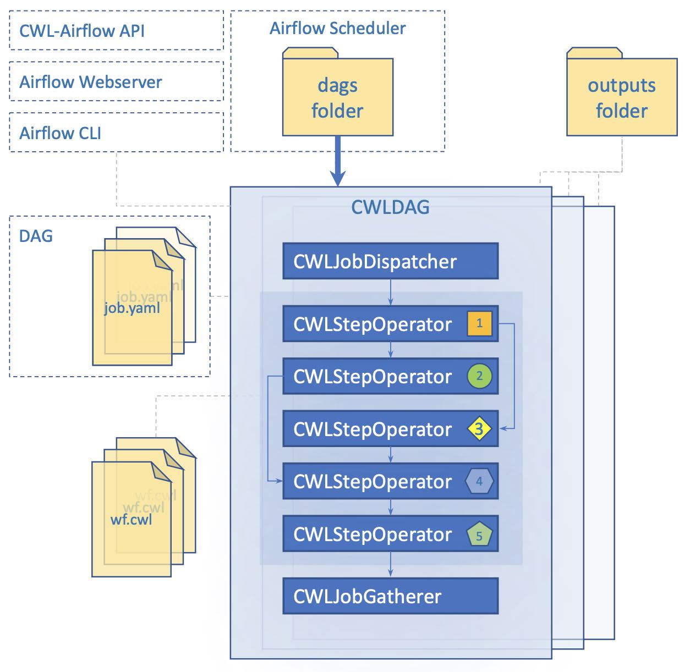

# How it works

## Keywords

1. **CWL descriptor file (aka pipeline or workflow)** - YAML or JSON file or its parsed content that complies with **[CWL v1.1](https://www.commonwl.org/v1.1/)** specification and describes inputs, outputs and sequence of steps to be executed.
2. **Job file (aka job or running configuration)** - YAML or JSON file or its parsed content that is used for initializing workflow inputs with values. Job can optionally include 2 additional fields:
   - **tmp_folder** - folder to keep temporary data that will be removed after successful workflow execution
   - **outputs_folder** - folder to move generated results after successful workflow execution
   
   If any of the abovementioned parameters was not set the default value will be derived from `[cwl]` section of **airflow.cfg**. For additional details refer to [Updating airflow.cfg](./how_to_use.md) section.
3. **DAG** - directed acyclic graph that describes workflow structure.

**Note**, for better understanding of CWL specification and its basic principles, please, refer to the official [CWL User Guide](http://www.commonwl.org/user_guide/).


## Concepts

The CWL-airflow package extends Airflow’s functionality with the ability to parse and execute workflows written with the CWL v1.1 specification. We defined 4 basic components — CWLJobDispatcher, CWLStepOperator, CWLJobCleanup, and CWLDAG. The latter is a class for combining the tasks into a DAG that reflects the CWL workflow structure. Every CWLStepOperator task corresponds to a workflow step and depends on others on the basis of the workflow step inputs and outputs. CWLJobDisptacher is used to provide the pipeline with the input data. CWLJobCleanup returns the calculated results to the output folder. Every new CWL workflow results in creation of a new CWLDAG. If the new job is run with the same pipeline, it will not create a new CWLDAG, but run the old one.

Previously, in order to execute CWLDAG a file describing workflow-specific input parameters in JSON or YAML format should have been placed in the special jobs folder. In the current version we removed the necessity for the jobs folder, as the new CWLDAGs can be easily triggered with the required input parameters through the REST API, Airflow UI or command line interface. In case someone needs to monitor a special folder for the new job files added, it can be easily implemented as a separate standard for Airflow DAG.



To add a new workflow, one should simply write a small python script (see example below) and place it into the DAGs folder. Only two parameters are required to initialize a new CWLDAG: path to the **workflow** file and **dag_id**.
```python
#!/usr/bin/env python3
from cwl_airflow.extensions.cwldag import CWLDAG
dag = CWLDAG(workflow="my_awesome_workflow.cwl", dag_id="my_awesome_dag")
```
There are only three functions that our CWLDAG is responsible for. First – to parse CWL file. Second – to validate CWL syntax. Third – to create a DAG, that will have the same structure as our workflow.