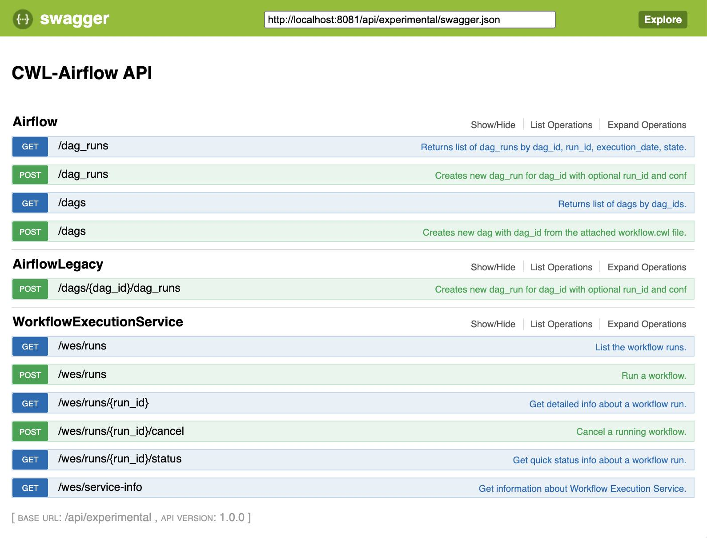

# How to use

## Initial configuration

Before using **CWL-airflow** it should be configured with `cwl-airflow init`

```
$ cwl-airflow init --help

usage: cwl-airflow init [-h] [--home HOME] [--config CONFIG] [--upgrade]

optional arguments:
  -h, --help       show this help message and exit
  --home HOME      Set path to Airflow home directory. Default: first try
                   AIRFLOW_HOME then '~/airflow'
  --config CONFIG  Set path to Airflow configuration file. Default: first try
                   AIRFLOW_CONFIG then '[airflow home]/airflow.cfg'
  --upgrade        Upgrade old CWLDAG files to the latest format. Default:
                   False
```

**Init command will run the following steps** for the specified `--home` and `--config` parameters:
- Call `airflow initdb`
- Update `airflow.cfg` to hide paused DAGs, skip loading example DAGs and **do not** pause newly created DAGs 
- If run with `--upgrade`, upgrade old CWLDAGs to correspond to the latest format, save original CWLDAGs into `deprecated_dags` folder   
- Put **clean_dag_run.py** into the DAGs folder (later its functions will be moved to API)

## Updating airflow.cfg


For precise configuration the `[cwl]` section can be added to **airflow.cfg**. All of the parameters descibed below are **optional** and will take their default values if not provided.

If job already included absolute paths for **tmp_folder** and **outputs_folder** the corresponent parameters from **airflow.cfg** will be ignored.

In other situation, for example when running CWL-Airflow with `docker-compose`, one may need to set the exact locations for **tmp**, **outputs**, **inputs** and **pickle** folders to allow their proper mounting to Docker container.

Also, following the abovementioned scenario, all input files required for workflow execution might be placed into **inputs_folder**. At the same time, when using relative locations in the job file, all paths will be resolved based on the same **inputs_folder**. For additional details refer to [Running CWL-Airflow with docker-compose](#running-cwl-airflow-with-docker-compose) section.

```ini
[cwl]

# Temp folder to keep intermediate workflow execution data.
# Ignored if job already has tmp_folder set as absolute path.
# If job has tmp_folder set as a relative path, it will be resolved based on this location.
# Default: AIRFLOW_HOME/cwl_tmp_folder
tmp_folder =

# Output folder to save workflow execution results.
# Ignored if job already has outputs_folder set as absolute path.
# If job has outputs_folder set as a relative path, it will be resolved based on this location.
# Default: AIRFLOW_HOME/cwl_outputs_folder
outputs_folder = 

# Folder to keep input files.
# If job has relative paths for input files they will be resolved based on this location.
# Default: AIRFLOW_HOME/cwl_inputs_folder
inputs_folder =

# Folder to keep pickled workflows for fast workflow loading.
# Default: AIRFLOW_HOME/cwl_pickle_folder
pickle_folder = 

# Boolean parameter to force using docker for workflow step execution.
# Default: True
use_container = 

# Boolean parameter to disable passing the current user id to "docker run --user".
# Default: False
no_match_user = 
```
  
## Adding a pipeline

The easiest way to add a new pipeline to CWL-airflow is to put the following python script into your DAGs folder.
```python
#!/usr/bin/env python3
from cwl_airflow.extensions.cwldag import CWLDAG
dag = CWLDAG(
    workflow="/absolute/path/to/workflow.cwl",
    dag_id="my_dag_name"
)
```
As `CWLDAG` class was inherited from `DAG`, additional arguments, such as `default_args`, can be provided. The latter can include `cwl` section similar to the one from **airflow.cfg** file, but with lower priority.

Alternatively to file location, the value of `workflow` parameter can be initialized with **base64 encoded zlib compressed** file content generated by the script below.
```python
from cwl_airflow.utilities.helpers import get_compressed
with open("workflow.cwl", "r") as input_stream:
    print(get_compressed(input_stream))
```

**After adding a new DAG**, Airflow Scheduler will load it (by default if happens **every 5 minutes**) and the DAG can be run.

## Executing a pipeline

The most convenient way to **manually execute** DAG is to trigger it in **Airflow UI**. Input parameters can be set in the **job** field of the running configuration.


Alternatively, DAGs can be triggered through the **Airflow CLI** with the JSON input paramerers file.

```sh
$ airflow trigger_dag --conf "{\"job\":$(cat ./bam-bedgraph-bigwig.json)}" bam-bedgraph-bigwig
```

## Posting pipeline execution progress and results

To make CWL-Airflow **post workflow executions progress and results** `process_report` connection should be added. Parameters can be adjusted based on the current needs.

```sh
$ airflow connections --add --conn_id process_report --conn_type http --conn_host localhost --conn_port 3070 --conn_extra "{\"endpoint\":\"/airflow/\"}"
```

## Using an API

Besides built-in experimental API from the Airflow Webserver, CWL-airflow provides **extended API** that supports [WES](https://github.com/ga4gh/workflow-execution-service-schemas) and can be run with `cwl-airflow api`

```
$ cwl-airflow api --help

usage: cwl-airflow api [-h] [--port PORT] [--host HOST]

optional arguments:
  -h, --help   show this help message and exit
  --port PORT  Set port to run API server. Default: 8081
  --host HOST  Set host to run API server. Default: 127.0.0.1
```

When run **API specification** can be accessed through [http://localhost:8081/api/experimental/ui/](http://localhost:8081/api/experimental/ui/). Otherwise, the same configuration is published on [SwaggerHub](https://app.swaggerhub.com/apis/michael-kotliar/cwl_airflow_workflow_execution_service/1.0.0) 



## Running CWL-Airflow with docker-compose

Work in progress. Coming soon!