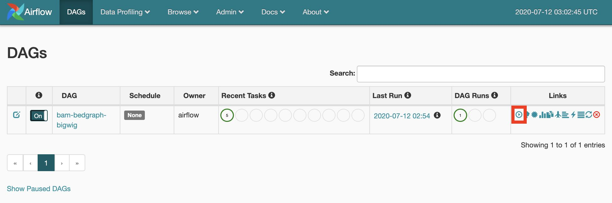
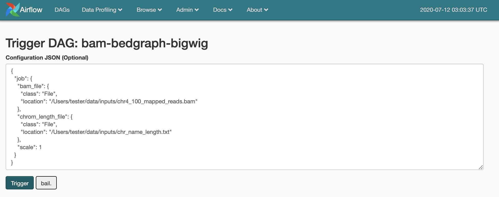

# How to use

## Initial configuration

Before using **CWL-airflow** it should be configured with `cwl-airflow init`

```
$ cwl-airflow init --help

usage: cwl-airflow init [-h] [--home HOME] [--config CONFIG] [--upgrade]

optional arguments:
  -h, --help       show this help message and exit
  --home HOME      Set path to Airflow home directory. Default: first try
                   AIRFLOW_HOME then '~/airflow'
  --config CONFIG  Set path to Airflow configuration file. Default: first try
                   AIRFLOW_CONFIG then '[airflow home]/airflow.cfg'
  --upgrade        Upgrade old CWLDAG files to the latest format. Default:
                   False
```

**Init command will run the following steps** for the specified `--home` and `--config` parameters:
- Call `airflow --help` to create a default `airflow.cfg`
- Update `airflow.cfg` to hide paused DAGs, skip loading example DAGs and connections and **do not** pause newly created DAGs. Also, we set our custom `logging_config_class` to split Airflow and CWL related logs into the separate files. In case of upgrading from the previous version of CWL-Airflow that used Airflow < 2.0.0 to the latest one, `airflow.cfg` will be backuped and upgraded to fit Airflow 2.1.4. You will have to manually make sure that all custom fields were properly copied to the new `airflow.cfg`
- Call `airflow db init` to init/upgrade Airflow metadata database.
- If run with `--upgrade`, upgrade old CWLDAGs to correspond to the latest format, save original CWLDAGs into `deprecated_dags` folder.
- Put **clean_dag_run.py** into the DAGs folder.

## Updating airflow.cfg


For precise configuration the `[cwl]` section can be added to **airflow.cfg**. All of the parameters descibed below are **optional** and will take their default values if not provided.

If job already included absolute paths for **tmp_folder** and **outputs_folder** the corresponent parameters from **airflow.cfg** will be ignored.

In other situation, for example when running CWL-Airflow with `docker-compose`, one may need to set the exact locations for **tmp**, **outputs**, **inputs** and **pickle** folders to allow their proper mounting to Docker container.

Also, following the abovementioned scenario, all input files required for workflow execution might be placed into **inputs_folder**. At the same time, when using relative locations in the job file, all paths will be resolved based on the same **inputs_folder**. For additional details refer to [Running CWL-Airflow with docker-compose](#running-cwl-airflow-with-docker-compose) section.

```ini
[cwl]

# Temp folder to keep intermediate workflow execution data.
# Ignored if job already has tmp_folder set as absolute path.
# If job has tmp_folder set as a relative path, it will be resolved based on this location.
# Default: AIRFLOW_HOME/cwl_tmp_folder
tmp_folder =

# Output folder to save workflow execution results.
# Ignored if job already has outputs_folder set as absolute path.
# If job has outputs_folder set as a relative path, it will be resolved based on this location.
# Default: AIRFLOW_HOME/cwl_outputs_folder
outputs_folder = 

# Folder to keep input files.
# If job has relative paths for input files they will be resolved based on this location.
# Default: AIRFLOW_HOME/cwl_inputs_folder
inputs_folder =

# Folder to keep pickled workflows for fast workflow loading.
# Default: AIRFLOW_HOME/cwl_pickle_folder
pickle_folder = 

# Boolean parameter to force using docker for workflow step execution.
# Default: True
use_container = 

# Boolean parameter to disable passing the current user id to "docker run --user".
# Default: False
no_match_user = 
```
  
## Adding a pipeline

### **Set absolute path to the workflow file**

The easiest way to add a new pipeline to CWL-airflow is to put the following python script into your DAGs folder. Here, `workflow` parameter is initialized with the absolute path to the CWL workflow file.

```python
#!/usr/bin/env python3
from cwl_airflow.extensions.cwldag import CWLDAG
dag = CWLDAG(
    workflow="/absolute/path/to/workflow.cwl",
    dag_id="my_dag_name"
)
```
As `CWLDAG` class was inherited from Airflow's `DAG`, additional arguments, such as `default_args`, can be provided when calling class constructor.

`default_args` can also include `cwl` section similar to the one from **airflow.cfg** file described in [Updating airflow.cfg](#updating-airflow.cfg) section. However, parameters from **airflow.cfg** will always **have higher priority** compared to those that were passed in constructor.

### **Use zlib compressed workflow file content**

Alternatively to file location, the value of `workflow` parameter can be initialized with **base64 encoded zlib compressed** file content. Below is an **example of script** generating compressed workflow content.
```python
from cwl_airflow.utilities.helpers import get_compressed
with open("workflow.cwl", "r") as input_stream:
    print(get_compressed(input_stream))
```

**Note**, to add a new pipeline one can also use **POST** to `/dags` API endpoing. For additional details refer to [Using an API](#using-an-api) section.

A new pipeline can be run after Airflow Scheduler loads new DAG (by default if happens **every 5 minutes**).

## Executing a pipeline

### **Using Airflow UI**

The most convenient way to **manually execute** DAG is to trigger it from **Airflow UI**. Input parameters can be set in the **job** section of the DAG run configuration as in the example below.




### **Using Airflow CLI**

Alternatively, DAGs can be triggered through the **Airflow CLI** with the JSON input paramerers file.

```sh
$ airflow trigger_dag --conf "{\"job\":$(cat ./bam-bedgraph-bigwig.json)}" bam-bedgraph-bigwig
```

**Note**, to trigger workflow execution one can also use **POST** to `/dag_runs` API endpoing. For additional details refer to [Using an API](#using-an-api) section.

## Posting pipeline execution progress, statistics and results

To make CWL-Airflow **post workflow executions progress, statistics and results** `process_report` connection should be added. Parameters can be adjusted based on the current needs following the example below.

```sh
$ airflow connections add process_report --conn-type http --conn-host localhost --conn-port 3070
```
In case CWL-Airflow failed to POST progress updates or workflow execution results, the corresponded records with the prefixes `post_progress__` and `post_results__` will be added to the Airflow Variables. Later, when CWL-Airlfow API run with `--replay N` argument, it will attemt to resend not delivered messages every N seconds.
Workflow execution statistics is sent as part of the progress report at the end of the pipeline execution regardless of whether it finished with success or failure. If progress report is sent from the task, the statistics will be set to "".

On the example below, the workflow execution statistics includes `total` section with the `start_date` in isoformat. This timestamp will be used as a reference point for all other `start_date` and `end_date` fields which are represented in `seconds.milliseconds` format. All `tmp_folder_size` and `outputs_folder_size` are in kBytes.

```JSON
{
  'state': 'success',
  'dag_id': 'star-index',
  'run_id': 'ba46dd51-9c7d-4f92-adc5-503a812ddb6d',
  'progress': 100,
  'statistics':
  {
    'version': '1.0',
    'total':
    {
      'tmp_folder_size': 3080904,
      'outputs_folder_size': 1538044,
      'start_date': '2021-01-28T20:55:03.258202+00:00',
      'end_date': 60.715
    },
    'steps':
    {
      'CWLJobDispatcher':
      {
        'tmp_folder_size': 4,
        'start_date': 2.69,
        'end_date': 6.96
      },
      'CWLJobGatherer':
      {
        'tmp_folder_size': 0,
        'start_date': 56.534,
        'end_date': 58.718
      },
      'star_generate_indices':
      {
        'tmp_folder_size': 3080900,
        'start_date': 10.657,
        'end_date': 52.23
      }
    }
  },
  'error': '',
  'logs': ''
}
```

## Using an API

Besides built-in experimental API from the Airflow Webserver, CWL-airflow provides **extended API** that supports [WES](https://github.com/ga4gh/workflow-execution-service-schemas) and can be run with `cwl-airflow api`

```
$ cwl-airflow api --help

usage: cwl-airflow api [-h] [--port PORT] [--host HOST]

optional arguments:
  -h, --help   show this help message and exit
  --port PORT  Set port to run API server. Default: 8081
  --host HOST  Set host to run API server. Default: 127.0.0.1
  --simulation SIMULATION
               Set path to the test suite file to simulate reports.
               Pipelines won't get triggered in this mode.
  --replay     REPLAY
               Retries to post undelivered progress and results reports to
               the process_report connection every N seconds. If connection
               is not set this parameter is ignored.
               Default: do not resend not delivered reports.
```

Although, **detailed API specification** available on [SwaggerHub](https://app.swaggerhub.com/apis/michael-kotliar/cwl_airflow_workflow_execution_service/1.0.1), here we provide the **most commonly used endpoints**.

### **1. Get list of dags**

`GET /dags`

Parameters:

|Name|In|Type|Required|Description|
|---|---|---|---|---|
|dag_ids|query|array[string]|false|Dag identifiers|

Response example:

```json
{
  "dags": [
    {
      "dag_id": "string",
      "tasks": [
        "string"
      ]
    }
  ]
}
```

### **2. Create new dag**

`POST /dags`

Parameters:

|Name|In|Type|Required|Description|
|---|---|---|---|---|
|dag_id|query|string|false|Dag identifier|
|body|body|object|false|none|
|workflow|body|string(binary)|false|CWL workflow file with embedded tools and all other dependencies|
|workflow_content|body|string|false|base64 encoded zlib compressed workflow content|

Response example:

```json
{
  "dag_id": "string",
  "dag_path": "string",
  "cwl_path": "string"
}
```

### **3. Get list of dag_runs**

`GET /dag_runs`

Parameters:

|Name|In|Type|Required|Description|
|---|---|---|---|---|
|dag_id|query|string|false|Dag identifier|
|run_id|query|string|false|Run identifier|
|execution_date|query|string(date-time)|false|Execution date|
|state|query|string|false|Dag run state|

Enumerated values:

|Parameter|Value|
|---|---|
|state|running|
|state|success|
|state|failed|

Response example:

```json
{
  "dag_runs": [
    {
      "dag_id": "string",
      "run_id": "string",
      "execution_date": "2019-08-24T14:15:22Z",
      "start_date": "2019-08-24T14:15:22Z",
      "state": "running",
      "tasks": [
        {
          "id": "string",
          "state": "scheduled"
        }
      ],
      "progress": 0
    }
  ]
}
```

### **4. Trigger dag**

`POST /dag_runs`

Parameters:

|Name|In|Type|Required|Description|
|---|---|---|---|---|
|dag_id|query|string|true|Dag identifier|
|run_id|query|string|false|Run identifier|
|conf|query|string|false|Run configuration (JSON-formatted string)|

Response example:

```json
{
  "dag_id": "string",
  "run_id": "string",
  "execution_date": "2019-08-24T14:15:22Z",
  "start_date": "2019-08-24T14:15:22Z",
  "state": "running"
}
```

## Running CWL-Airflow with docker-compose

To start CWL-Airflow with LocalExecutor using docker-compose, run the following commands
```
cd ./packaging/docker_compose/local_executor
docker-compose up --build
```

Default values for mount volumes, mapped ports and other configurations can be found `.env` file in the
same folder.
