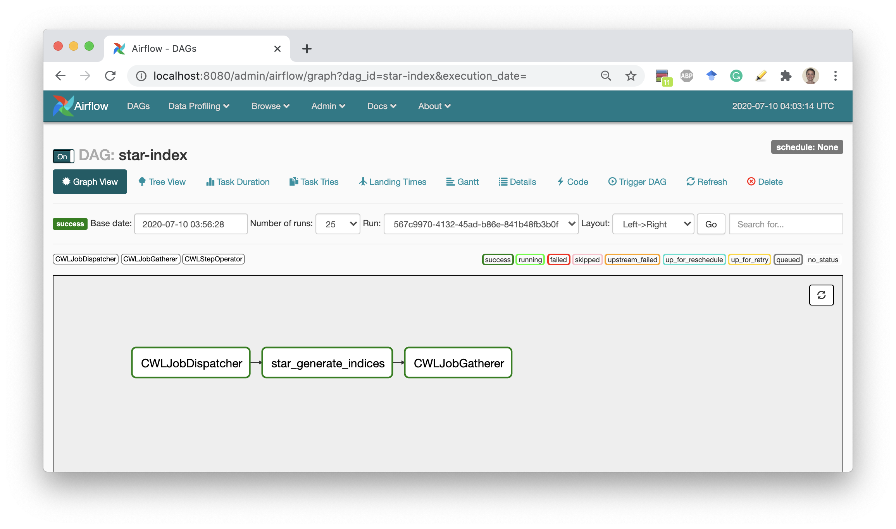

# Quick start

We assume that you have already installed **python 3.8**, latest **pip**, latest **setuptools**
and **docker** that has access to pull images from the [DockerHub](https://hub.docker.com/).
If something is missing or should be updated refer to the [How to install](./how_to_install.md)
or [What if is doesn't work](./what_if_it_doesnt_work.md) sections.

1. Install CWL-airflow
    ```sh
    $ pip3 install cwl-airflow \
    --constraint "https://raw.githubusercontent.com/Barski-lab/cwl-airflow/master/packaging/constraints/constraints-3.8.txt"
    ```
    When using optional `--constraint` parameter you can limit dependencies to those versions that were tested with your Python.

2. Configure CWL-airflow (for details refer to [Initial configuration](./how_to_use.md) section)
    ```sh
    $ cwl-airflow init
    ```

3. Get some workflows to run, for example from [SciDAP](https://github.com/datirium/workflows)
    ```sh
    $ git clone https://github.com/datirium/workflows.git --recursive
    ```

4. To be able to use Airflow Webserver, create a new user following the example below
   ```sh
   airflow users create \
   --username admin \
   --firstname firstname \
   --lastname lastname \
   --role Admin \
   --email firstname@lastname.org
   ```

5. In a separate terminals start Airflow Webserver, Scheduler and our API
   ```sh
   $ airflow scheduler
   $ airflow webserver
   $ cwl-airflow api
   ```

6. Schedule execution of a sample pipeline. Set the workflow number with `--range`
    ```sh
    $ cwl-airflow test --suite workflows/tests/conformance_tests.yaml --range 1
    ```

6. Open Airflow Webserver (by default [http://127.0.0.1:8080/admin/](http://127.0.0.1:8080/admin/)) and wait until Airflow Scheduler pick up a new DAG (by default every 5 min) and execute it. **On completion all results and temporary files will be removed**, so you can safely schedule other workflows by setting different values to `--range` parameter. Take a look at the [How to use](./how_to_use.md) section for more details.


