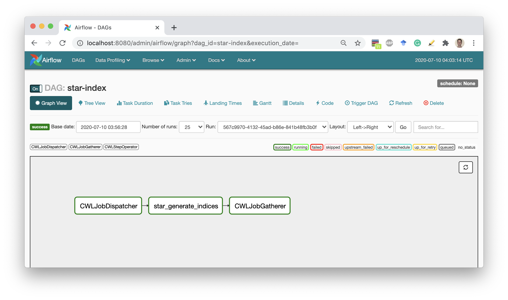

# Run demo

## Locally

We assume that you have already installed and properly configured **python**, latest **pip**, latest **setuptools**
and **docker** that has access to pull images from the [DockerHub](https://hub.docker.com/). If something is missing or should be updated refer to the [Installation](./installation.md) or [Troubleshooting](./troubleshooting.md) sections.

1. Install *cwl-airflow*
    ```sh
    $ pip install cwl-airflow==1.0.16 --find-links https://michael-kotliar.github.io/cwl-airflow-wheels/ # --user
    ```
    `--user` - explained in [Installation](./installation.md) section

2. Init configuration
    ```sh
    $ cwl-airflow init
    ```

3. Run *demo*
    ```sh
    $ cwl-airflow demo --auto
    ```
    
    For every submitted workflow you will get the following information
    
    ```bash
    CWL-Airflow demo mode
    Process demo workflow 1/3
    Load workflow
    - workflow:    # path from where we load the workflow file
    - job:         # path from where we load the input parameters file
    - uid:         # unique identifier for the submitted job
    Save job file as
    -              # path where we save submitted job for CWL-Airflow to run
    ```
    
    `uid` - the unique identifier used for DAG ID and output folder name generation.

4. When all demo wokrflows are submitted the program will provide you with the link for Airflow web interface (by default it is accessible from your [localhost:8080](http://127.0.0.1:8080/admin/)).
It may take some time (usually less then half a minute) for Airflow web interface to load and display all the data.

5. On completion the workflow results will be saved in the current folder.



## VirtualBox

In order to run CWL-Airflow virtual machine you have to install [Vagrant](https://www.vagrantup.com/downloads.html) and [VirtualBox](https://www.virtualbox.org/wiki/Downloads). The host machine should have access to the Internet, at least 8 CPUs and 16 GB of RAM.

1. Clone CWL-Airflow repository
    ```bash
    $ git clone https://github.com/Barski-lab/cwl-airflow
    ```

2. Chose one of three possible configurations to run

   **Single node**
   ```bash
   $ cd ./cwl-airflow/vagrant/local_executor
   ```
   **Celery Cluster of 3 nodes (default queue)**
   ```bash
   $ cd ./cwl-airflow/vagrant/celery_executor/default_queue
   ```
   **Celery Cluster of 4 nodes (default + advanced queues)**
   ```bash
   $ cd ./cwl-airflow/vagrant/celery_executor/custom_queue
   ```

3. Start virtual machine
    ```bash
    $ vagrant up
    ```
    Vagrant will pull the latest virtual machine image (about 3.57 GB) from [Vagrant Cloud](https://app.vagrantup.com/michael_kotliar/boxes/cwl-airflow). When started the following folders will be created on the host machine in the current directory.
    ```bash
    ├── .vagrant
    └── airflow
        ├── dags
        │   └── cwl_dag.py      # creates DAGs from CWLs
        ├── demo
        │   ├── cwl
        │   │   ├── subworkflows
        │   │   ├── tools
        │   │   └── workflows   # demo workflows
        │   │       ├── chipseq-se.cwl
        │   │       ├── super-enhancer.cwl
        │   │       └── xenbase-rnaseq-se.cwl
        │   ├── data            # input data for demo workflows
        │   └── job             # sample job files for demo workflows
        │       ├── chipseq-se.json
        │       ├── super-enhancer.json
        │       └── xenbase-rnaseq-se.json
        ├── jobs                # folder for submitted job files
        ├── results             # folder for workflow outputs
        └── temp                # folder for temporary data

    ```

4. Connect to running virtual machine through `ssh`
    ```sh
    $ vagrant ssh master
    ```

5. Submit all demo workflows for execution
    ```sh
    $ cd /home/vagrant/airflow/results
    $ cwl-airflow demo --manual
    ```

    For every submitted workflow you will get the following information

    ```bash
    CWL-Airflow demo mode
    Process demo workflow 1/3
    Load workflow
    - workflow:    # path from where we load the workflow file
    - job:         # path from where we load the input parameters file
    - uid:         # unique identifier for the submitted job
    Save job file as
    -              # path where we save submitted job for CWL-Airflow to run
    ```

    `uid` - the unique identifier used for DAG ID and output folder name generation.

6. Open Airflow web interface ([localhost:8080](http://127.0.0.1:8080/admin/)) and, if multi-node configuration is run, Celery Flower Monitoring Tool ([localhost:5555](http://127.0.0.1:5555)). It might take up to 20 seconds for Airflow web interface to display all newly added workflows.

7. On completion, you can view workflow execution results in the `/home/vagrant/airflow/results` folder of the Virtual Machine or in `./airflow/results` folder on your host machine.

8. Stop `ssh` connection to the virtual machine by pressing  `ctlr+D` and then run one of the following commands
   ```sh
   $ vagrant halt               # stop virtual machines
   ```
   or
   ```bash
   $ vagrant destroy            # remove virtual machines
   $ rm -rf ./airflow .vagrant  # remove created folders
   ```

