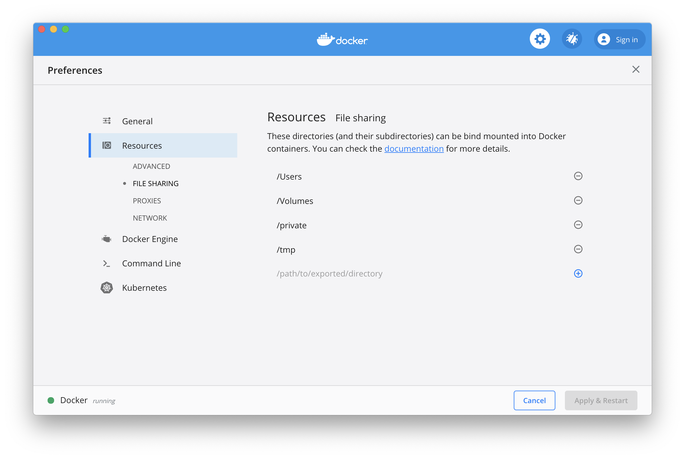

# What if is doesn't work


## CWL-airflow is not found
   
   Perhaps, you have installed it with `--user` option and your **PATH**
   variable doesn't include your user based Python3 **bin** folder.
   Update **PATH** with the following command
   
   ```sh
   $ export PATH="$PATH:`python3 -m site --user-base`/bin"
   ```  

## Docker is unable to pull images from the Internet

  If you are using proxy, your Docker should be configured properly too.
  Refer to the [official documentation](https://docs.docker.com/config/daemon/systemd/#httphttps-proxy).

## Docker is unable to mount input files

  When running Docker App on **macOS** there is a default list of directories that Docker has permission to mount. If your input files are located in the directories that are not included in this list, you should add them in **Preferences / Resources / File Sharing**.


## Missing DAGs in Airflow UI
  
  If after adding a new DAG you don't see it in Airflow UI, first check if Airflow Scheduler is running, then make sure that **dag_dir_list_interval** parameter in **airflow.cfg** is not too big. By default, Airflow Scheduler will check for new DAGs every 5 minutes.
  
## Workflow execution failed

  Make sure that your CWL descriptor file is correct and DAG was triggered with correct input parameters. You can always check it with **cwltool** of the same version that is included in CWL-airflow package.
  
  ```sh
  cwltool --debug WORKFLOW JOB
  ```

## Fails to compile ruamel.yaml
   
  Perhaps, you should update your **setuptools** and try to reinstall **ruamel.yaml**

## mysql_config not found

  When running on Ubuntu with MySQL backend, it might be necessary to install **libmysqlclient-dev**
  ```sh
  sudo apt-get install libmysqlclient-dev
  ```
